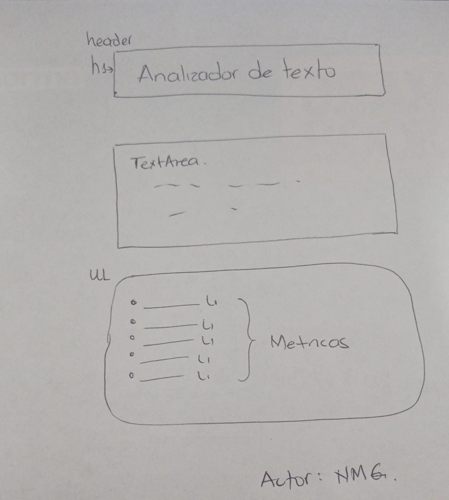
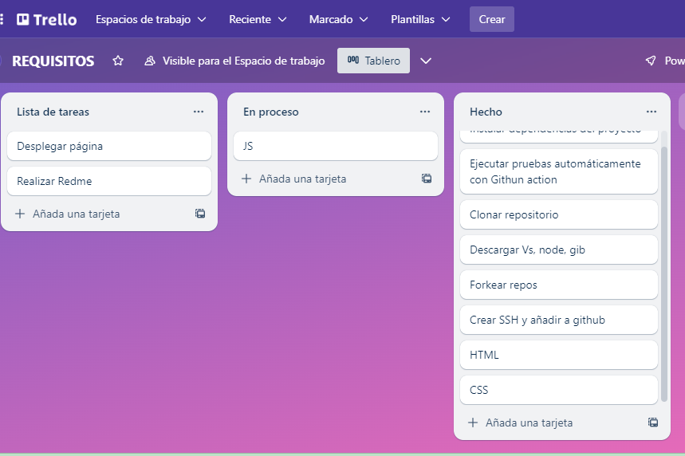

# Analizador de texto

## 1. Objetivo
Brindar al ususario una experiencia de alta calidad en la identificación de métricas que pueden ser utilizados en estadisticas.

Las métricas utilizadas son: Conteo de palabras, Conteo de caracteres, Conteo de palabras excluyendo espacios y signos de puntuación,Longitud promedio de palabras, Conteo de números y Suma de números

## 2. Metodología
1. Lectura de readme original para identificar que solicitaba el proyecto.

2. Realice el prototipo de baja fidelidad.

3. En Trello desarrolle la planificación del proyecto.

4. Descargue los programas que solicitaban, creando la SSH Key en GitHub.

5. Inicie creando el proyecto en HTM de acuerdo a los requisitos minimos.

6. Luego segui con CSS con lo básico.

7. Desarrole las funciones en JavaScript.

8. Corrí los test

9. Desplegue la página en github.

## 3. Funcionalidades

Mi proyecta tiene las siguiente funcionalidades:
1. Permitir al usuario ingresar un texto escribiéndolo en un cuadro de texto.
2. Calcular las siguientes métricas solicitadas y actualiza el resultado en tiempo real a medida que el usuario escribe su texto:
3. La aplicación debe permitir limpiar el contenido de la caja de texto haciendo clic en un botón.
4. Cumple con los ccriterios de aceptación minimos del proyecto
5. Todos los test pasan.
-npm run test:oas
-npm run test
npm run test:e2e
